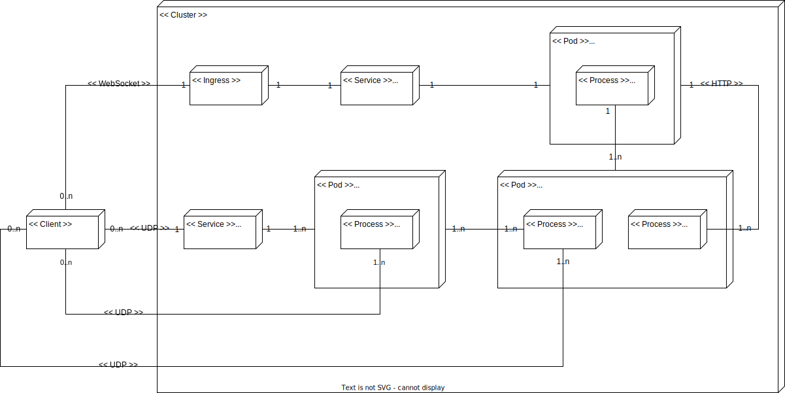

# janus-cloud-helm

[Janus Cloud](https://github.com/OpenSight/janus-cloud) brings you scalablity of [Janus Gateway](https://janus.conf.meetecho.com).  
This project is made to run Janus Cloud on Kubernetes.

## System Composition



## Prerequisites

- ingress-controller is installed

If you are using Docker Desktop, you can install ingress-controller by following [quick start](https://kubernetes.github.io/ingress-nginx/deploy/#quick-start).

```bash
helm upgrade --install ingress-nginx ingress-nginx \
  --repo https://kubernetes.github.io/ingress-nginx \
  --namespace ingress-nginx --create-namespace
```

## Installation

You can install it by one line:

```bash
helm upgrade --install janus-cloud janus-cloud \
  --repo https://savercorp.github.io/helm-charts
```

Or step by step:

```bash
helm repo add saver https://savercorp.github.io/helm-charts
helm install janus-cloud saver/janus-cloud
```
